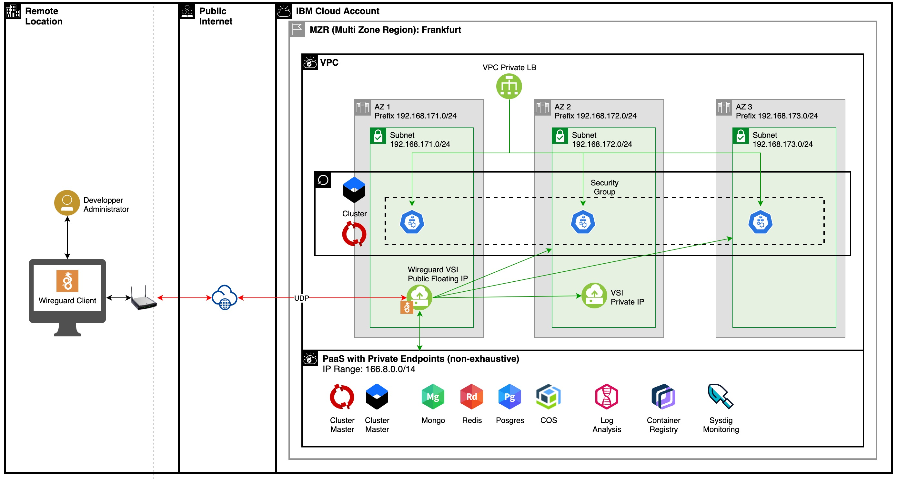
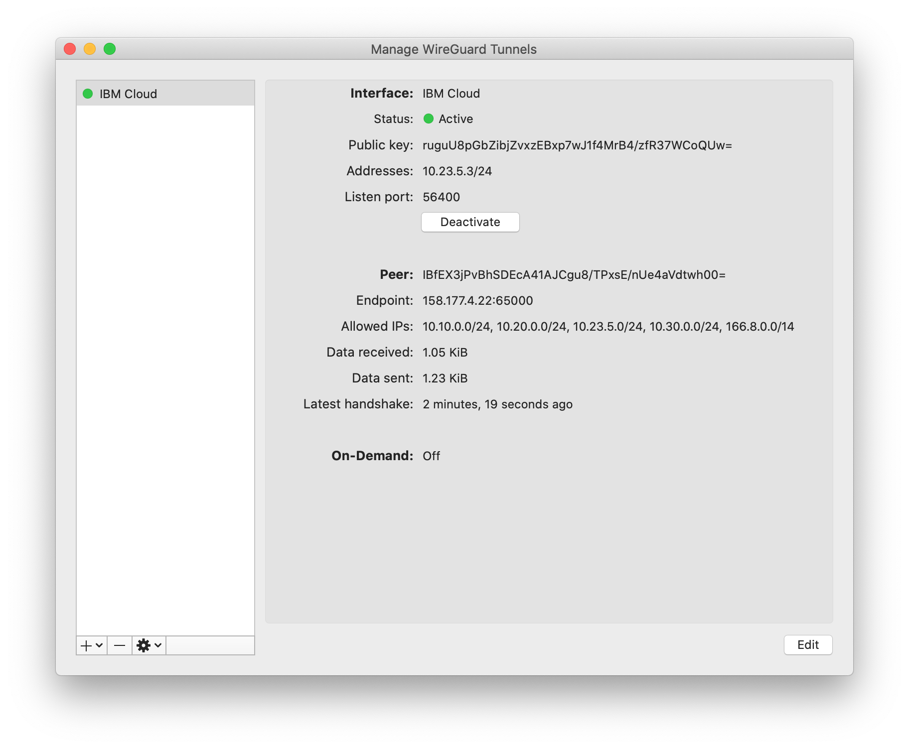

# How to use Wireguard VPN to connect to IBM Cloud?



## Install Wireguard Client on your desktop

1. Download and install the wireguard from [here](https://www.wireguard.com/install/)

## Create the VPC Infrastructure

1. Create a VPC
    ```
    ibmcloud is vpc-create vpc-wireguard
    ```

1. Create two subnets
    ```
    ibmcloud is subnet-create sub1-wireguard $vpc eu-de-1 --ipv4_cidr_block 10.243.0.0/24
    ibmcloud is subnet-create sub1-wireguard $vpc eu-de-2 --ipv4_cidr_block 10.243.64.0/24	
    ```

1. Add 4 **Inbound** Rules in the Security Group
    
    ```
    ```

    Protocol | Source Type | Source | Port | Description
    ---  | --- | --- | --- | ---
    TCP  | Any | 0.0.0.0/0 | 22-22       | Allow incoming SSH traffic
    TCP  | Any | 0.0.0.0/0 | 443-443     | Allow incoming SSL traffic
    UDP  | Any | 0.0.0.0/0 | 65000-65000 | Allow incoming traffic from Wireguard client
    ICMP | Any | 0.0.0.0/0 | Any         | Allow incoming ping traffic

1. Add 1 **Outbound** Rule in the Security

    ```
    ```
    
    Protocol | Destination Type | Destination | Port | Description
    --- | --- | --- | --- | ---
    ALL | Any | 0.0.0.0/0 | All | Allow all outbound IPv4 traffic.


## Provision a VSI in VPC

1. Create a SSH key
    ```
    ssh-keygen -t rsa -b 4096 -C “wireguard” -f ~/.ssh/key-wireguard
    ```

1. Create a VSI name `vsi-wireguard`, zone `fra-01`, image `ubuntu-18.04`, compute `cx2-2x4`

1. Associate this VSI with the Security Group previously created.

1. Create a public Floating IP and save it for later. 

1. Test the connectin via ssh
    ```
    ssh -i ~/.ssh/key-wireguard root@IP-ADDRESS
    ```

## Install Wireguard on VSI

1. Add the Wireguard repository to your sources list. Apt will then automatically update the package cache.
    ```
    sudo add-apt-repository ppa:wireguard/wireguard
    ```

1. Install Wireguard. The wireguard package will install all necessary dependencies.
    ```
    sudo apt install wireguard
    ```

1. Install Wireguard DKMS Module
    ```
    apt-get install wireguard-dkms wireguard-tools linux-headers-$(uname -r)
    ```

## Configure WireGuard Server

1. Generate a private and public key pair for the WireGuard **server**
    ```
    umask 077
    wg genkey | tee wg_server_private_key | wg pubkey > wg_server_public_key
    ```

1. Generate a private and public key pair for the WireGuard **client**
    ```
    wg genkey | tee wg_client_private_key | wg pubkey > wg_client_public_key
    ```

1. Create the file /etc/wireguard/wg0.conf and add the contents indicated below. You’ll need to enter your server’s private key in the PrivateKey field, and its IP addresses in the Address field.

    ```
    [Interface]
    Address = 10.23.5.1/24
    SaveConfig = false

    PostUp = iptables -A FORWARD -i %i -j ACCEPT; iptables -t nat -A POSTROUTING -o ens3 -j MASQUERADE
    PostDown = iptables -D FORWARD -i %i -j ACCEPT; iptables -t nat -D POSTROUTING -o ens3 -j MASQUERADE
    
    ListenPort = 65000
    PrivateKey = <wg_server_private_key>

    [Peer]
    PublicKey = <wg_client_public_key>
    AllowedIPs = 10.23.5.3/32
    ```

## Active IP Forwarding

1. Edit `sysctl.conf`file
    ```
    vi /etc/sysctl.conf
    ```

1. Uncomment line
    ```
    net.ipv4.ip_forward = 1
    ```

1. Apply changes
    ```
    sysctl -p
    ```

## Start the Wireguard Service

1. Start Wireguard
    ```
    wg-quick up wg0
    ```

1. Enable the Wireguard service to automatically restart on boot
    ```
    sudo systemctl enable wg-quick@wg0
    ```

1. Check if the VPN tunnel is running with the following two commands:
    ```
    sudo wg show
    ```
    You should see a similar output:
    ```
    root@vsi-wireguard:~# sudo wg show
    interface: wg0
    public key: xFQeWCn1j/MHIDizWsCJcvTrHpzMdtxLh5j6Pog8U3I=
    private key: (hidden)
    listening port: 65000
    ```


## Wireguard Client

1. Create the configuration file and add the contents indicated below. You’ll need to enter its IP addresses in the Address field.

    ```
    [Interface]
    PrivateKey = <wg_client_private_key>
    Address = 10.23.5.3/24
    
    [Peer]
    PublicKey = <wg_server_public_key>
    AllowedIPs = 10.10.0.0/24, 10.20.0.0/24, 10.30.0.0/24, 10.23.5.0/24, 166.8.0.0/14
    Endpoint = <wireguard-vsi-public-floating-ip>:65000
    ```
    AllowedIPs includes
    * 3 VPC subnets IP ranges: 10.10.0.0/24, 10.20.0.0/24, 10.30.0.0/24
    * Wireguard range: 10.23.5.0/24
    * IBM Cloud Service Endpoint (CSE): 166.8.0.0/14

1. Activate VPN

    

## Test your tunnel

1. Make sure there is some data transferred by running one of this command:
    ```
    sudo wg show wg0 latest-handshakes
    ruguU8pGbZibjZvxzEBxp7wJ1f4MrB4/zfR37WCoQUw=	1594914544
    ```
    ```
    sudo wg show wg0 transfer
    ruguU8pGbZibjZvxzEBxp7wJ1f4MrB4/zfR37WCoQUw=	692	604
    ```

1. From your local machine, ping the private IP of the Wireguard VSI address
    ```
    ping 10.23.5.1
    ```

1. From your local machine, ping the private endpoint of one of your [Kubernetes cluster](https://cloud.ibm.com/kubernetes/clusters) such as
    ```
    ping c2.private.eu-de.containers.cloud.ibm.com
    ```

## Resources
* [set-up-wireguard-vpn-on-ubuntu](https://www.linode.com/docs/networking/vpn/set-up-wireguard-vpn-on-ubuntu/)